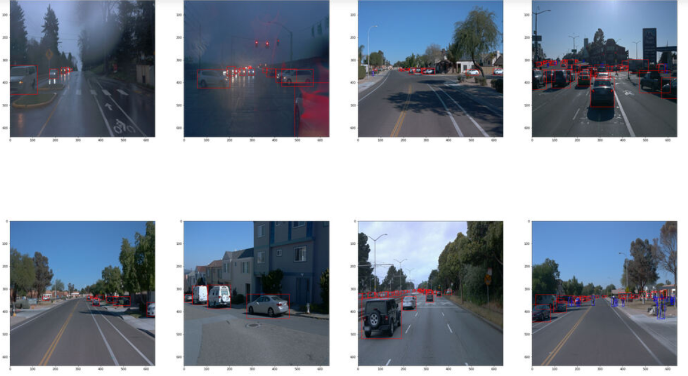
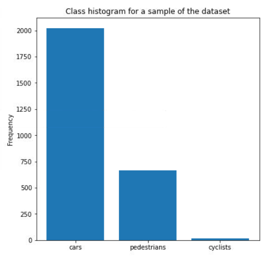
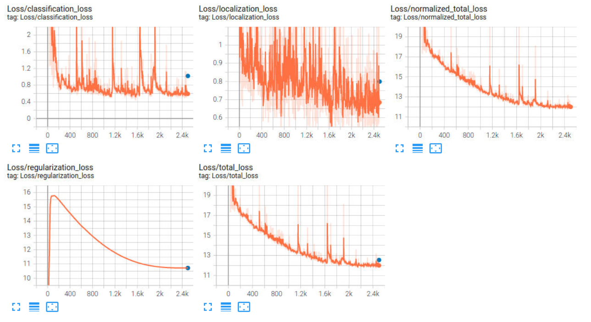
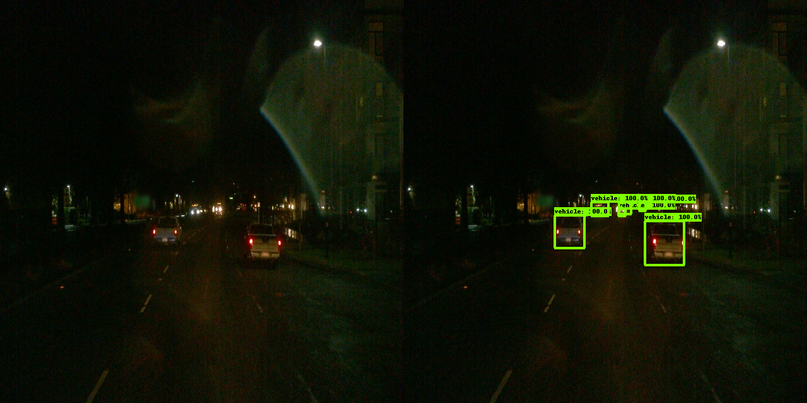
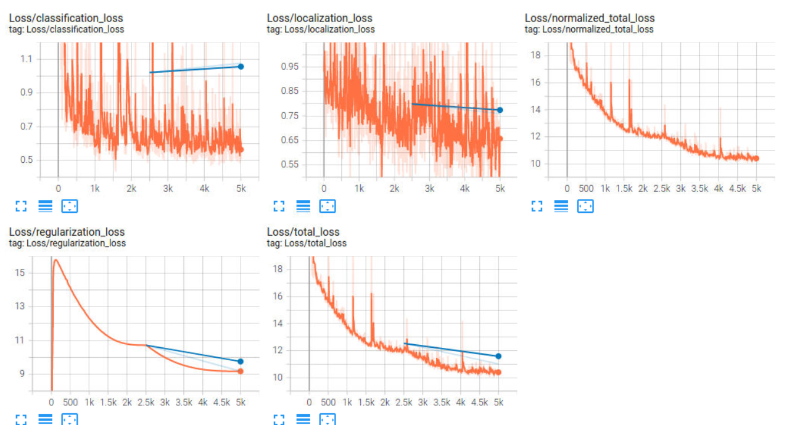

## Submission Template

### Project overview

Object Detection in an urban environment, this is a project focused on detecting objects in images from camera captured from the Waymo Open Dataset. The aim of this project is to detect objects (cars, pedestrians and cyclists) which are common elements found in real life scenarios by self-driving cars. Therefore, detecting these objects is extremely important for self driving cars to prevent accidents while controlling the vehicle.

### Set up

I used Udacity's workspace to work in the project. You can follow the steps described in README.md. There are no Git commits nor Github repository.

### Dataset
#### Dataset analysis

Looking at the images I saw a high variance in image features such as day/night differences, number of objects per image, object scaling.

All images have fixed size of 640 X 640 with 3 channels.

Looking at the class histogram, there are more cars than pedestrians and there are more pedestrians than cyclists.

#### Cross validation

I split the data from training_and_validation into two sets: training set with an 80% of the data and validation set
with 20% of the data.

Since the data is stored in tfrecord files i could not hand pick and shuffle the data to keep a uniform distribution of different features in the data set. So I just picked the first 80% and put it into the training set. And the rest into the validation set.

### Training
#### Reference experiment

First Experiment:

On the first experiment the loss looks like it decreases but it reaches a plateau at 12 total_loss, so it seems as the model is underperforming the data set and I need a bigger model with more parameters that can fit the data.

As for classification loss and localization loss both are too noisy, but they seem to decrease too slow, probably changing the learning rate to a bigger value can accelerate learning.

As for training metrics they have a mAP of 0.001471 at step 2500, which is not good.

This is an image of the loss values:

#### Improve on the reference
Second Experiment:

I removed random_crop_image augmentation and added two augmentations - random_adjust_brightness and random_adjust_contrast.

I thought that one of the most important aspects to add more variation to the dataset was to add brightness variations such as day / night variations and contrast variations such as foggy weather vs clear weather variations.

The total loss decreased from 12 to 10.4.
 
Here is an image with bounding boxes and confidence scores: 

And here is Tensorboard's loss evaluation:

Third Experiment:

I read the proto files for each field in the config file of the model for Tensorflow's object detection API.

I changed the optimizer for Adam optimizer,

I changed the learing rate for exponential decay learning rate instead of Cosine Decay Learning Rate and set its parameters to fit the learning steps for the whole training process of 2500.

I removed staircase.

I added data_augmentation_option of random_crop_image.

Added 2 Layers: num_layers_before_predictor: 6 instead of 4.

I tried changing the optimizer for Adam but strange errors started to appear:

RuntimeError: `merge_call` called while defining a new graph or a tf.function. 
This can often happen if the function `fn` passed to `strategy.run()` contains a nested `@tf.function`, 
and the nested `@tf.function` contains a synchronization point, such as aggregating gradients (e.g, optimizer.apply_gradients), 
or if the function `fn` uses a control flow statement which contains a synchronization point in the body. Such behaviors are not yet supported. Instead, please avoid nested `tf.function`s or control flow statements that may potentially cross a synchronization boundary, for example, wrap the `fn` passed to `strategy.run` or the entire `strategy.run` inside a `tf.function` or move the control flow out of `fn`

